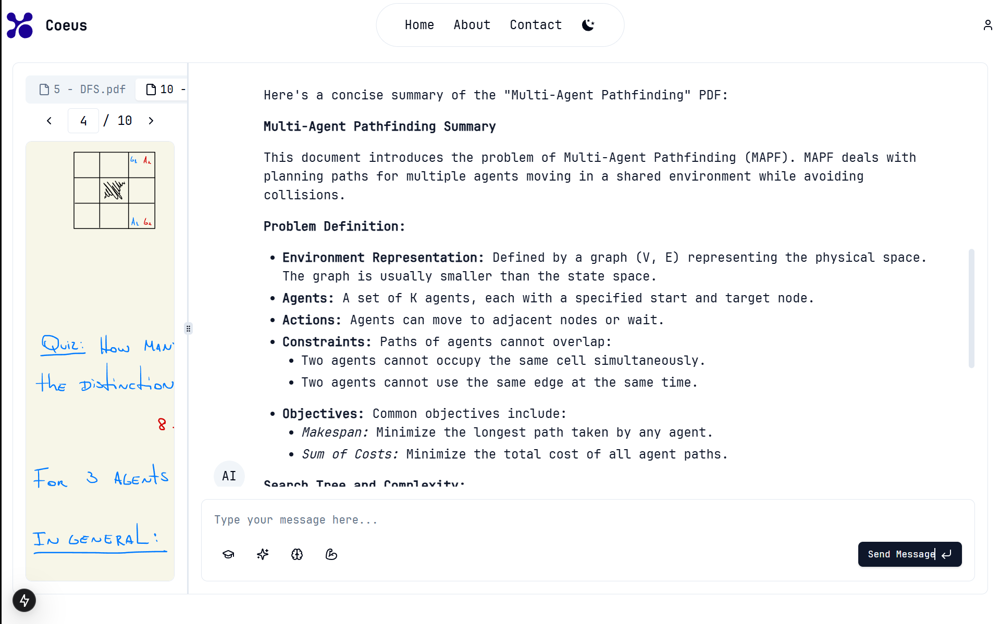

# Coeus AI

<div align="center">
  
</div>

## Overview

Coeus AI is an interactive educational assistant that allows users to upload PDF documents and interact with them through an AI-powered chat interface. The application provides various tools to help users understand and learn from their documents, including generating study plans, summaries, detailed explanations, and practice questions. With a user-friendly interface, responsive design, and secure authentication system, Coeus AI aims to revolutionize the way students and professionals learn from their documents.

## Features

- **Multiple PDF Support**: Upload and interact with up to 3 PDF documents simultaneously
- **PDF Document Processing**: Upload and interact with PDF documents up to 25MB in size
- **Tab-based PDF Navigation**: Easily switch between multiple uploaded PDFs
- **AI-Powered Chat Interface**: Ask questions about your documents and receive intelligent responses
- **Multi-document Analysis**: AI can analyze and respond to queries across multiple PDFs
- **Toolbox with Educational Features**:
  - Generate comprehensive study plans
  - Create quick summaries of document content
  - Get detailed explanations of complex topics
  - Generate practice questions to test understanding
  - Select specific PDFs for each tool operation
- **User Authentication**: Secure login and registration system with protected routes
- **Responsive Design**: Works on desktop and mobile devices
- **Dark/Light Mode**: Choose your preferred theme
- **Real-time Streaming Responses**: See AI responses as they're generated
- **PDF Management**: Add new PDFs or remove specific documents without refreshing
- **User Profile Management**: Update user information through a dedicated profile page
- **About Page**: Learn about the application's purpose and features
- **Contact Page**: Connect with the developer through social media links

## Screenshots
<div>
  
  
  
  
  
  
  
  
  
  
</div>

## Technical Stack

- **Frontend Framework**: Next.js with React (using the App Router)
- **UI Components**: shadcn/ui (based on Radix UI) with Tailwind CSS for styling
- **PDF Processing**: react-pdf for rendering PDFs in the browser
- **File Handling**: react-dropzone for drag-and-drop file uploads
- **AI Integration**: Google Gemini 2.0 Flash model via the Google Generative AI SDK
- **Streaming Responses**: Server-side streaming for real-time AI responses
- **Authentication**: NextAuth.js for user authentication and session management
- **Database**: Prisma ORM with SQLite for user data storage
- **Password Hashing**: bcryptjs for secure password storage

## Getting Started

### Prerequisites

- Node.js 18.x or higher
- npm or yarn package manager
- Google Gemini API key

### Installation

1. Clone the repository

```bash
git clone https://github.com/yourusername/coeus-ai.git
cd coeus-ai
```

2. Install dependencies

```bash
npm install
# or
yarn install
```

3. Set up environment variables

Create a `.env` file in the root directory with the following variables:

```
DATABASE_URL="file:./dev.db"
GOOGLE_GEMINI_API_KEY="your-gemini-api-key"
NEXTAUTH_SECRET="your-nextauth-secret"
NEXTAUTH_URL="http://localhost:3000" # In development
```

4. Initialize the database

```bash
npx prisma migrate dev --name init
```

5. Start the development server

```bash
npm run dev
# or
yarn dev
```

6. Open [http://localhost:3000](http://localhost:3000) with your browser to see the application

## Development

### Routing Structure

Coeus AI uses Next.js App Router for page routing and navigation. Here's an overview of the application's routing structure:

#### Public Pages
- **Home Page** (`/`): The main application interface with PDF upload, chat, and toolbox
- **About Page** (`/about`): Information about Coeus AI and its features
- **Contact Page** (`/contact`): Developer contact information and social media links
- **Authentication Pages**:
  - Login Page (`/auth/login`): User login with email and password
  - Registration Page (`/auth/register`): New user registration
  - Error Page (`/auth/error`): Authentication error handling

#### Protected Pages
- **Profile Page** (`/profile`): User profile management (requires authentication)

#### API Routes
- **Authentication API**:
  - NextAuth API (`/api/auth/[...nextauth]`): Handles authentication flows
  - Registration API (`/api/auth/register`): Handles user registration
- **Chat API** (`/api/chat`): Processes chat messages and AI responses
- **PDF Upload API** (`/api/upload-pdf`): Handles PDF file uploads
- **User Profile API** (`/api/user/profile`): Manages user profile updates

#### Navigation Flow
- The Header component provides navigation links to Home, About, and Contact pages
- Authentication status determines available navigation options:
  - Unauthenticated users see Sign In and Sign Up buttons
  - Authenticated users see a user dropdown with Profile and Sign Out options
- Protected routes redirect unauthenticated users to the login page with a callback URL
- After successful authentication, users are redirected to their originally requested page

### Database Schema

### Database Schema

The application uses Prisma with SQLite for data persistence:

#### User Model
- `id`: String (Primary Key, CUID)
- `name`: String (Optional)
- `email`: String (Unique)
- `password`: String (Hashed)
- `emailVerified`: DateTime (Optional)
- `image`: String (Optional)
- `createdAt`: DateTime
- `updatedAt`: DateTime
- `sessions`: Relation to Session model

#### Session Model
- `id`: String (Primary Key, CUID)
- `sessionToken`: String (Unique)
- `userId`: String (Foreign Key to User)
- `expires`: DateTime

### Project Structure

```
/
├── prisma/               # Database schema and migrations
├── public/               # Static assets
├── src/
│   ├── app/              # Next.js App Router pages
│   │   ├── api/          # API routes
│   │   ├── auth/         # Authentication pages
│   │   └── profile/      # User profile page
│   ├── components/       # React components
│   │   ├── PDFViewer/    # PDF viewing components
│   │   ├── auth/         # Authentication components
│   │   └── ui/           # UI components
│   ├── lib/              # Utility functions and libraries
│   └── types/            # TypeScript type definitions
└── ...config files
```

## Deployment

For production deployment, consider the following:

1. Migrate from SQLite to a more robust database like PostgreSQL
2. Set up proper CORS configuration if deploying the frontend and backend separately
3. Configure proper session expiration times for security
4. Implement email verification for enhanced security (currently not implemented)

The easiest way to deploy your Next.js app is to use the [Vercel Platform](https://vercel.com/new) from the creators of Next.js.

## Environment Variables

- `GOOGLE_GEMINI_API_KEY`: API key for Google Gemini AI
- `DATABASE_URL`: Connection string for the SQLite database
- `NEXTAUTH_SECRET`: Secret key for NextAuth.js JWT encryption
- `NEXTAUTH_URL`: Base URL for NextAuth.js callbacks (in production)

## Contribution Guidelines

We welcome contributions to Coeus AI! Here's how you can contribute:

1. **Fork the Repository**: Create your own fork of the project
2. **Create a Branch**: Make your changes in a new branch
3. **Follow Code Style**: Match the existing code style and conventions
4. **Write Tests**: Add tests for new features when applicable
5. **Submit a Pull Request**: Open a PR with a clear description of your changes

### Development Workflow

1. Set up your local development environment following the installation instructions
2. Make your changes with clear, descriptive commit messages
3. Test your changes thoroughly before submitting
4. Document any new features or changes to existing functionality

## Troubleshooting

### Common Issues

1. **PDF Upload Failures**
   - Ensure the PDF is under the 25MB size limit
   - Check that the file is a valid PDF format
   - Try a different browser if issues persist

2. **Authentication Problems**
   - Clear browser cookies and try again
   - Ensure your email and password meet the requirements
   - Check that the database connection is working properly

3. **AI Response Errors**
   - Verify your Gemini API key is valid and has sufficient quota
   - Check your internet connection
   - Try with a smaller or different PDF if the current one is causing issues

4. **Performance Issues**
   - Large PDFs may cause slower performance
   - Multiple concurrent users can affect response times
   - Check system resources if hosting the application yourself

### Getting Help

If you encounter issues not covered here, please open an issue on the GitHub repository with:
- A clear description of the problem
- Steps to reproduce the issue
- Any relevant error messages or screenshots

## Performance Considerations

- **PDF Size**: Larger PDFs require more memory and processing power
- **Concurrent Users**: The application performance may degrade with many simultaneous users
- **API Rate Limits**: Be aware of Google Gemini API rate limits in production
- **Database Scaling**: Consider migrating to a more robust database for production use
- **Caching**: Implement caching strategies for frequently accessed data
- **Server Resources**: Ensure adequate CPU and memory for handling PDF processing
- **Network Bandwidth**: Streaming responses require stable network connections

## License

This project is licensed under the MIT License - see the LICENSE file for details.
